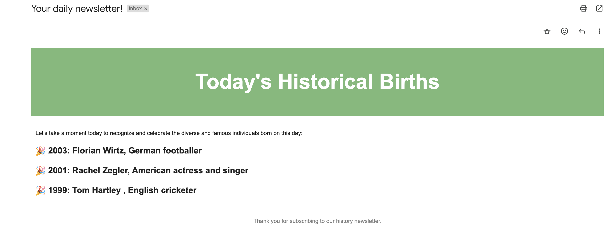
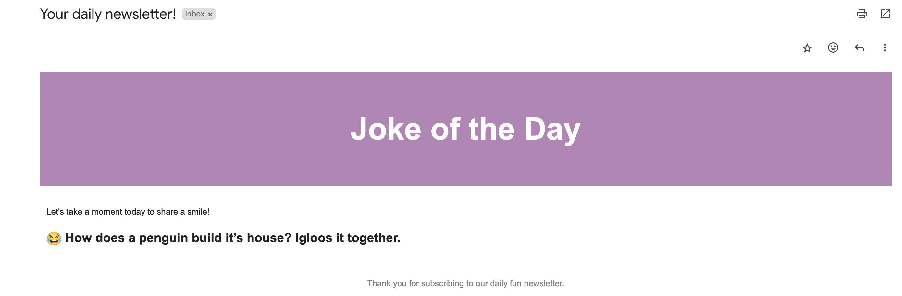

# Gmail API Newsletter Generator

Gmail API Newsletter Generator - a Python application designed to automate the creation and distribution of email newsletters. This tool gatheres content via specified APIs—such as historical births on this day (Wikimedia API), random dad jokes (Icanhazdadjoke API) and constructs an engaging newsletter format that is then sent to a user-specified email address.

## Features

- **Dynamic API Integration**: The application integrates with two public APIs. It fetches historical events of the day from Wikimedia and a random joke from the icanhazdadjoke.com API.
- **Email Integration**: Using the Gmail API, the application sends fetched and compiled HTML content as a newsletter to a specified email address.
- **Customizable Content**: Users can select which API's content (Wikimedia historical events or jokes) they wish to receive in their newsletter via command-line arguments.
- **Secure Authentication**: Utilizes environment variables for secure authentication handling (for API tokens and Gmail access).

## Getting started

1. To install the required dependencies, navigate to the project folder and run:

    `pip3 install -r requirements.txt`

2. To set up environment variables create a `.env` file in the root directory and update it with your credentials and tokens:

    ```plaintext
    WIKIMEDIA_ACCESS_TOKEN=YourWikimediaToken
    USER_EMAIL=YourEmailForUserAgent
    APP_PASSWORD=YourAppPasswordForGmail
    ```

    [How to Generate Wikimedia token](https://api.wikimedia.org/wiki/Getting_started_with_Wikimedia_APIs)

    [How to Generate Gmail App Password](https://support.google.com/accounts/answer/185833?hl=en)

3. Run the project:

    Ensure you provide a valid email and choose between the two API options (`wikimedia` or `jokes`). Execute the command:

    ```python3 daily-newsletter.py your-email@example.com api_choice```

4. If evething is okay, you will receive an email with the newsletter content.

## To run unit tests

1. `pytest`

## Visuals for newsletter content:
- Historical events from Wikimedia API:

    
- Random dad joke from icanhazdadjoke API:

    
